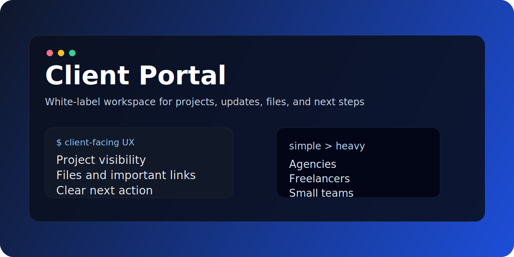

# Client Portal

White-label client portal for projects, updates, files, and next steps.

## What it is

Client Portal is a lightweight product direction for agencies, freelancers, and small teams who need a clean place for clients to:

- follow project progress
- review updates
- access files
- keep important links in one place
- understand the next action clearly

## Product idea

The goal is not to replace heavy enterprise PM tools.

The goal is to give service businesses a simple branded workspace that feels clearer, calmer, and easier for clients to use.

## Core principles

- simple client-facing UX
- project visibility
- updates and files in one place
- next-step clarity
- branding / white-label support

## Good fit for

- agencies with ongoing project delivery
- freelancers who want a polished client workspace
- boutique teams replacing messy email threads
- service businesses productizing their delivery experience

## Early roadmap

- projects and statuses
- updates and milestone communication
- files and important links
- client-friendly navigation
- white-label branding model

## Status

Early public repo / product framing.

## Related

- [vibe-portal](https://github.com/Chnurok/vibe-portal) — AI-assisted product direction around the same space
- [Chnurok](https://github.com/Chnurok) — profile and related software projects
